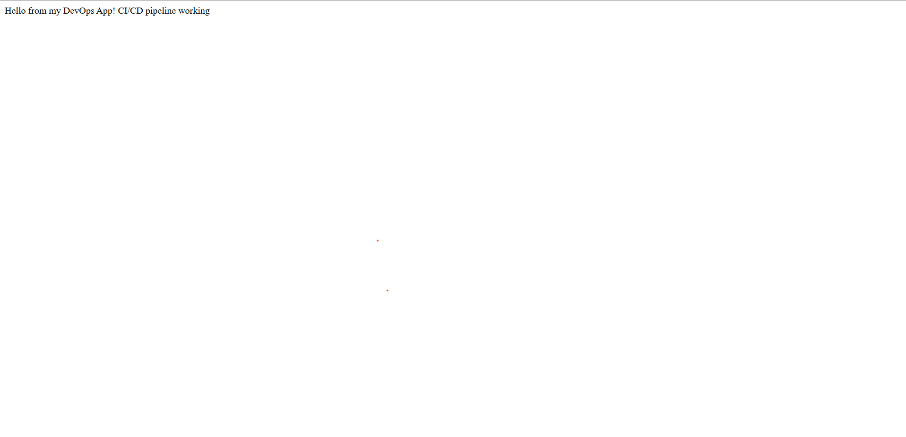
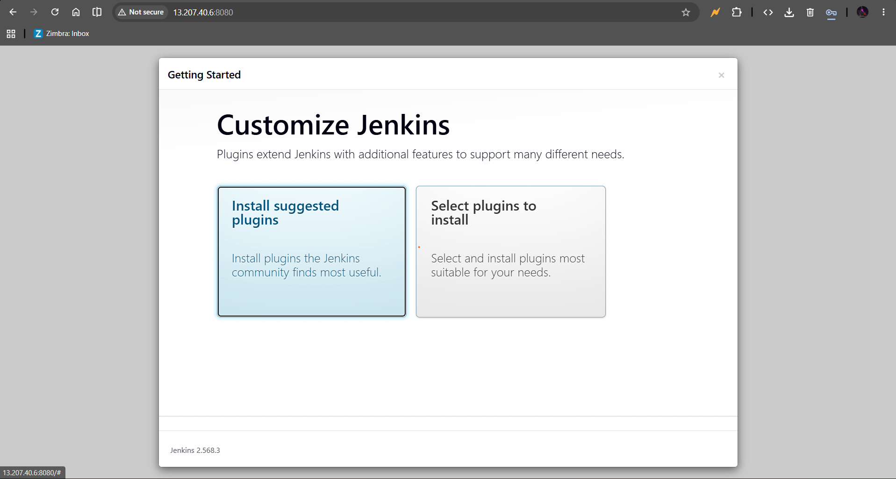
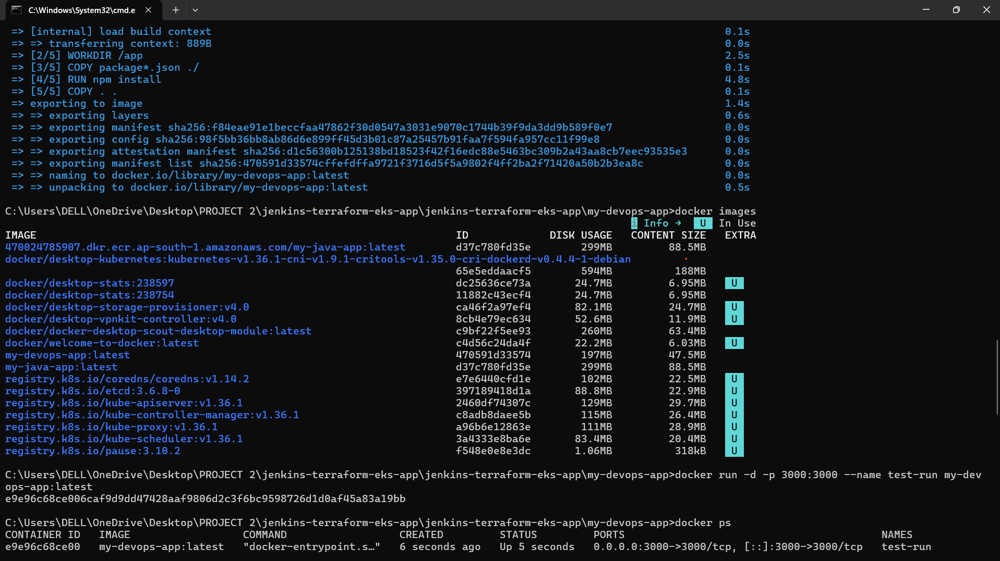
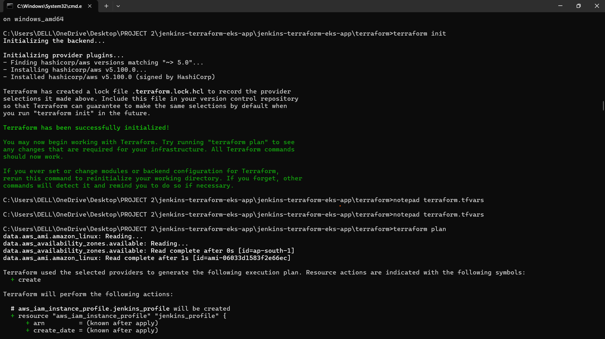
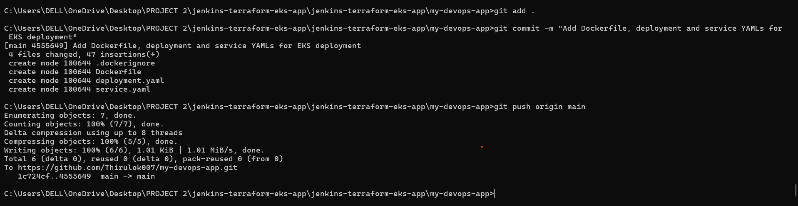

 My DevOps App

A production-style CI/CD pipeline that provisions cloud infrastructure with Terraform, builds and containerizes an application with Docker, and deploys it to Kubernetes on AWS EKS — fully automated through Jenkins.

---

 Overview

This project demonstrates an end-to-end DevOps workflow: from a code push all the way to a live, publicly accessible application running on a managed Kubernetes cluster.

Flow:

---

Tech Stack

| Category | Tools |
|---|---|
| CI/CD | Jenkins |
| Infrastructure as Code | Terraform |
| Containerization | Docker |
| Orchestration | Kubernetes (Amazon EKS) |
| Cloud Provider | AWS (EKS, ELB, VPC, EC2) |
| Application | Node.js |

---

 Project Structure

my-devops-app/
├── Dockerfile # Container image definition
├── deployment.yaml # Kubernetes Deployment manifest
├── service.yaml # Kubernetes Service (LoadBalancer)
├── server.js # Application source
├── package.json # Node.js dependencies
└── screenshots/ # Project evidence

---

How It Works

1. **Provision** — Terraform spins up the VPC, EC2 (Jenkins server), IAM roles, and EKS cluster on AWS.
2. **Build** — Jenkins pipeline triggers on code push, builds a Docker image of the application.
3. **Push** — Docker image is pushed to Docker Hub.
4. **Deploy** — Kubernetes manifests (`deployment.yaml`, `service.yaml`) deploy the app to the EKS cluster.
5. **Expose** — A Kubernetes `LoadBalancer` service provisions an AWS ELB, exposing the app publicly.

---

 Result

The application is live and accessible via the AWS Load Balancer:

Hello from my DevOps App! CI/CD pipeline working

---

 Screenshots

| App Running | Jenkins Setup |
|---|---|
|  |  |

| Docker Build & Run | Terraform Provisioning |
|---|---|
|  |  |

| GitHub Push |
|---|
|  |

---

 Key Learnings

- Provisioning cloud infrastructure declaratively with Terraform
- Building automated CI/CD pipelines with Jenkins
- Containerizing applications with Docker
- Deploying and exposing services on Kubernetes (EKS)
- Debugging real-world AWS networking (Load Balancer types, security groups, IAM roles)

---

Author

**Thirulok**
GitHub: [@Thirulok007](https://github.com/Thirulok007)